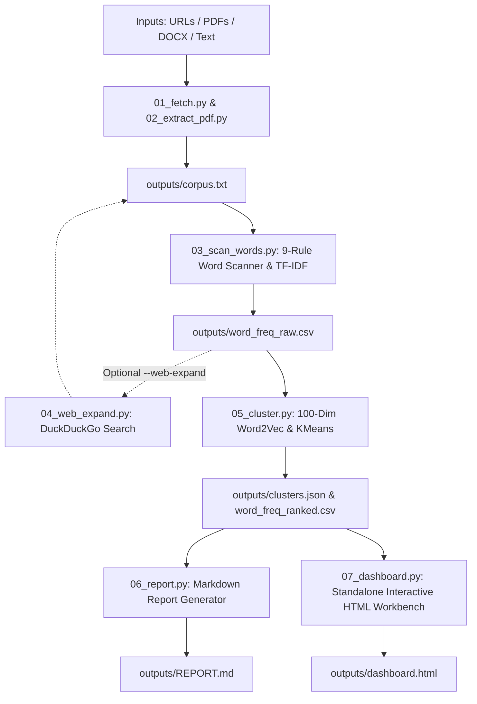

# CENTROID
### Local Word-Frequency & Semantic Centroid Analysis Engine

> **Created by [Justin Ray](https://trustnodelogic.com) — [Trust Node Logic](https://trustnodelogic.com)**  
> *Deterministic · Local-First · Zero Cloud APIs · Generative Engine Optimization (GEO)*

---

```
   ██████╗███████╗███╗   ██╗████████╗██████╗  ██████╗ ██╗██████╗ 
  ██╔════╝██╔════╝████╗  ██║╚══██╔══╝██╔══██╗██╔═══██╗██║██╔══██╗
  ██║     █████╗  ██╔██╗ ██║   ██║   ██████╔╝██║   ██║██║██║  ██║
  ██║     ██╔══╝  ██║╚██╗██║   ██║   ██╔══██╗██║   ██║██║██║  ██║
  ╚██████╗███████╗██║ ╚████║   ██║   ██║  ██║╚██████╔╝██║██████╔╝
   ╚═════╝╚══════╝╚═╝  ╚═══╝   ╚═╝   ╚═╝  ╚═╝ ╚═════╝ ╚═╝╚═════╝ 
```

---

## 1. What Is CENTROID?

**CENTROID** is a high-precision, offline natural language processing and semantic cluster analysis workbench. It extracts, filters, vectors, and clusters raw unstructured text across websites, technical whitepapers, PDF dossiers, and Word documents—transforming sprawling, noisy text corpora into clean, actionable semantic topography.

Unlike modern cloud AI tools that depend on external LLMs, subscription tokens, and third-party APIs, CENTROID runs **100% locally** on standard CPU/RAM. It uses battle-tested classical and neural NLP algorithms (NLTK tokenizers, TF-IDF matrices, Gensim Word2Vec continuous bag-of-words/skip-gram embeddings, and Scikit-learn K-Means centroid clustering) with pinned random seeds to deliver **fully reproducible, private, and deterministic analysis**.

CENTROID was engineered by **Justin Ray** at **[Trust Node Logic](https://trustnodelogic.com)** to solve a foundational bottleneck in information retrieval: cutting through conversational filler, marketing fluff, and navigational bloat to expose the dense core vocabulary and structural centroids of any topic or competitive landscape.

---

## 2. What Does It Do?

CENTROID operates as an orchestrated, 8-stage modular data pipeline. Every stage reads clean inputs, verifies state checkpoints, and writes structured flat files (`.csv`, `.json`, `.md`, `.html`):



### The Pipeline Stages

1. **Stage 00 — State & Checkpoint Manager (`pipeline/00_state.py`)**:
   - Maintains cryptographic SHA-256 hashes of input files and run metadata in `outputs/run_state.json`.
   - Skips stages whose inputs have not changed since the last successful run, saving processing time on large document sets.
   - Provides partial resumption if interrupted and permits running any single stage in isolation.

2. **Stage 01 — Multi-Source URL Ingestion (`pipeline/01_fetch.py`)**:
   - Ingests web pages line-by-line from `inputs/urls.txt`.
   - Strips boilerplate HTML, navigational headers, footers, citation brackets, Wikipedia hatnotes, infoboxes, and editorial chrome.
   - Appends clean source text to `outputs/corpus.txt` demarcated by standard metadata boundary headers.

3. **Stage 02 — Document & PDF Extraction (`pipeline/02_extract_pdf.py`)**:
   - Parses local `.pdf` files from `inputs/pdfs/` via PyMuPDF (`fitz`).
   - Extracts Word documents (`.docx`) and raw text files (`.txt`) from `inputs/docs/` and `inputs/raw/`.
   - Performs unicode normalization, ligatures unfolding, and line unwrapping before piping into the unified corpus.

4. **Stage 03 — Precision Word Scanner & TF-IDF Filter (`pipeline/03_scan_words.py`)**:
   - Implements a strict **9-Rule Lexical Scanner**:
     - *Rule 1*: Case normalization (lowercased).
     - *Rule 2*: Token length threshold (tokens < 3 characters discarded).
     - *Rule 3*: Non-alphabetic scrubbing (`[^a-z\-']` pruned).
     - *Rule 4*: Stopwords removal using curated English stopwords (`wordlists/stopwords_en.txt`) and user exclusions (`wordlists/custom_ignore.txt`).
     - *Rule 5*: Technical, web coding, and boilerplate lingo scrubbing (`wordlists/web_coding_lingo.txt`).
     - *Rule 6*: Target word tracking (`wordlists/target_words.txt`) to preserve domain keywords regardless of global frequency.
     - *Rule 7*: Optional Porter stemming (`--stem`).
     - *Rule 8*: Document-level TF-IDF computation across all source files.
     - *Rule 9*: Global & per-source frequency ledger export to `outputs/word_freq_raw.csv`.

5. **Stage 04 — Autonomous Web Expansion (`pipeline/04_web_expand.py`) [Optional]**:
   - Takes the top 50 discovered keywords and executes rate-limited queries (1 req/sec) via DuckDuckGo.
   - Retrieves top organic result URLs, extracts new domain-adjacent vocabulary, and appends them with a `web-expand` source marker to discover peripheral terms.

6. **Stage 05 — Vector Embedding & Centroid Clustering (`pipeline/05_cluster.py`)**:
   - Evaluates a composite score: `(0.60 × raw_count) + (0.40 × tfidf_score)`.
   - Trains a local **100-dimensional Word2Vec** neural embedding space over the corpus with a 5-word co-occurrence sliding window.
   - Runs **K-Means clustering** (default $k=10$, configurable) with `random_state=42` to group semantically linked words into coherent topical clusters.
   - Identifies the mathematical anchor word (the centroid closest to the cluster mean) and computes cluster density, cohesion, and percentage share of the corpus.
   - Emits `outputs/word_freq_ranked.csv` and `outputs/clusters.json`.

7. **Stage 06 — Markdown Intelligence Report (`pipeline/06_report.py`)**:
   - Generates `outputs/REPORT.md` featuring corpus summary telemetry, ranked vocabulary tables, cluster breakdowns, and lexical gap analysis.

8. **Stage 07 — Standalone Interactive Topography Workbench (`pipeline/07_dashboard.py`)**:
   - Generates `outputs/dashboard.html`, a single-file interactive data science dashboard requiring **no Node.js, no npm, no backend server, and no build step**.
   - Opens instantly via `file://` in any standard web browser.

---

## 3. What Can It Do? (Key Capabilities & Workflows)

### 🎯 Generative Engine Optimization (GEO) & Prompt Priming
Modern Large Language Models (LLMs) and Generative Search Engines (Google AI Overviews, Perplexity, SearchGPT) weigh dense, semantically focused noun phrases and domain verbs far more heavily than syntactic filler.
- CENTROID isolates the exact lexical centroids that define authority in a subject.
- **Token Savings Calculation**: Quantifies token reduction (~1.33 LLM tokens per pruned word) between raw source prose and distilled signal, reducing prompt bloat, eliminating hallucination risks, and reducing LLM inference latency.

### ⏱️ Readability Delta & Human Efficiency Metrics
- Evaluates the **Readability Delta** benchmarked against standard human reading speed (220 words per minute).
- Visually shows the reading time saved: for example, reducing a 20-minute rambling article corpus to a 4-minute distillation of core concepts.
- Quantifies the **Information Density Score** (% core semantic signal retained vs. conversational noise eliminated).

### 🔍 Target Lexical Gap Analysis
- When given a list of target words (`wordlists/target_words.txt`), CENTROID performs an automated audit against the ingested text.
- Surfaces **Content Gaps**: highlights target words that are completely missing (`ABSENT`) or statistically under-represented (`LOW FREQ`) compared to industry corpora.
- Invaluable for technical documentation audits, SEO keyword parity, curriculum verification, and competitive content analysis.

### 🧭 General Mode vs. Directed Mode
- **General Mode**: Unbiased exploratory NLP. Lets the natural distribution of the corpus dictate the top clusters and anchor themes.
- **Directed Mode**: Prioritizes predefined subject targets (`wordlists/target_words.txt`), highlighting how closely external or competitor documents align with your core focus areas.

### 🗺️ Interactive Topographic Cluster Map
- Custom SVG cartography canvas featuring coordinate axes, caliper ticks, datum labels, and centroid diamond pins.
- Selecting any cluster dynamically highlights its peripheral tokens and populates the **Telemetry Readout Panel**.
- Uses pure ASCII/Unicode progress bars (`████████░░`) and telemetry chips for a clean terminal/data-workbench feel.

### ⚡ Client-Side Ingestion Bay & Instant Workbench
The standalone `dashboard.html` includes an interactive in-browser control surface:
- **URL Quick Entry & Multi-Slot Manager**: Paste up to 10 URLs directly in the UI.
- **PDF & Document Drag-and-Drop**: Drop local PDF, TXT, or DOCX files directly onto the browser canvas.
- **Live Client-Side Re-Scanning**: Re-filter, adjust stopword rules, or switch between General and Directed modes client-side without restarting Python.
- **Instant Payload Export**: One-click download of the cleaned corpus text (`.txt`) or the complete structured data ledger (`.csv`).

---

## 4. Repository Structure

```
CENTROID/
├── AGENT.md                  ← Comprehensive system specification & engineering nerve center
├── README.md                 ← System documentation, capabilities, and quickstart (You are here)
├── LICENSE                   ← MIT License
├── CHANGELOG.md              ← Release and version history
├── CONTRIBUTING.md           ← Contributor expectations and pull request workflow
├── SECURITY.md               ← Responsible disclosure policy and local data security
├── requirements.txt          ← Python dependencies (all local, open-source libraries)
├── run.py                    ← Root CLI entry point with automatic .venv detection
│
├── docs/
│   ├── ARCHITECTURE.md       ← Full pipeline architecture & 7-stage analytical methodology
│   └── DEVELOPMENT.md        ← Developer setup, CLI guide, testing, and debugging
│
├── examples/
│   ├── README.md             ← Walkthrough of multi-domain synthetic sample run
│   └── sample_input/         ← Sample plain-text documents across diverse domains
│
├── inputs/
│   ├── urls.txt              ← Target URLs for automated web scraping (one URL per line)
│   ├── pdfs/                 ← Drop zone for local PDF documents
│   ├── docs/                 ← Drop zone for .docx and .txt documents
│   └── raw/                  ← Drop zone for raw text files
│
├── pipeline/
│   ├── __init__.py           ← Package metadata and centralized version declaration
│   ├── common.py             ← Shared text normalization, deterministic seeds & safe JSON
│   ├── 00_state.py           ← State manager, SHA-256 caching & partial resume engine
│   ├── 01_fetch.py           ← Static web scraper with aggressive noise stripping
│   ├── 02_extract_pdf.py     ← High-speed local PDF & document text extractor (PyMuPDF)
│   ├── 03_scan_words.py      ← 9-rule word scanner, tokenizer & TF-IDF calculator
│   ├── 04_web_expand.py      ← Autonomous DuckDuckGo peripheral vocabulary scraper
│   ├── 05_cluster.py         ← 100-dim Word2Vec trainer & KMeans centroid clusterer
│   ├── 06_report.py          ← Analytical Markdown report generator
│   ├── 07_dashboard.py       ← Standalone interactive HTML dashboard compiler
│   └── run.py                ← Core pipeline orchestrator script
│
├── wordlists/
│   ├── stopwords_en.txt      ← Comprehensive baseline English stopwords
│   ├── custom_ignore.txt     ← User-defined words to exclude (e.g. brand names, irrelevant terms)
│   ├── web_coding_lingo.txt  ← Web development, UI, CSS, and HTML artifacts to scrub
│   └── target_words.txt      ← Target vocabulary for Gap Analysis & Directed Mode
│
├── outputs/
│   ├── corpus.txt            ← Consolidated plain-text corpus extracted from all sources
│   ├── word_freq_raw.csv     ← Complete frequency and TF-IDF ledger of every surviving token
│   ├── word_freq_ranked.csv  ← Ranked top vocabulary with cluster assignments and scores
│   ├── clusters.json         ← Structured centroid clusters, anchor terms, and vector metrics
│   ├── run_state.json        ← Checkpoint tracking database (stage timestamps, hashes, verdicts)
│   ├── REPORT.md             ← Formatted, human-readable analytical report
│   ├── dashboard_template.html ← Raw data science workbench UI template
│   └── dashboard.html        ← Self-contained interactive dashboard (open with any browser)
│
└── tests/
    ├── test_centroid.py      ← Comprehensive unit and regression test suite
    ├── validate_pipeline.py  ← End-to-end integration smoke test
    └── fixtures/             ← Multi-domain synthetic test documents
```

---

## 5. Quickstart & Installation

### Prerequisites
- **Python 3.11+** (Windows, macOS, or Linux)
- Standard modern web browser (Chrome, Firefox, Edge, Safari)

### 1. Clone & Setup Virtual Environment

```bash
# Clone the repository
git clone https://github.com/your-username/CENTROID.git
cd CENTROID

# Create and activate virtual environment
python -m venv .venv

# Windows (PowerShell):
.venv\Scripts\Activate.ps1

# macOS / Linux:
source .venv/bin/activate
```

### 2. Install Dependencies

```bash
pip install -r requirements.txt
python -m nltk.downloader punkt stopwords averaged_perceptron_tagger
```

### 3. Add Your Input Data
- Paste web links into `inputs/urls.txt` (one per line).
- Drop PDF files into `inputs/pdfs/`.
- Drop Word docs or text files into `inputs/docs/`.
- *(Optional)* Add target keywords to `wordlists/target_words.txt` to trigger Gap Analysis.

### 4. Run the Pipeline

```bash
# Run full pipeline with interactive dashboard generation
python run.py --dashboard

# Run with customized cluster counts and top word limits
python run.py --top 500 --clusters 8 --dashboard

# Enable autonomous web expansion via DuckDuckGo
python run.py --web-expand --dashboard

# Force re-execution of all stages (ignoring cached state)
python run.py --force --dashboard

# Execute a single stage in isolation
python run.py --stage scan
python run.py --stage cluster --clusters 6
```

### 5. View the Results
- Open `outputs/dashboard.html` in any browser:
  ```bash
  # Windows
  start outputs/dashboard.html

  # macOS
  open outputs/dashboard.html

  # Linux
  xdg-open outputs/dashboard.html
  ```
- Review the analytical executive summary in `outputs/REPORT.md`.

---

## 6. CLI Reference

| Flag | Default | Description |
|---|---|---|
| `--dashboard` | `False` | Compiles and updates the interactive HTML dashboard (`outputs/dashboard.html`). |
| `--top N` | `1000` | Limits output reports and tables to the top $N$ ranked words. |
| `--clusters N` | `10` | Number of KMeans clusters ($k$) to partition the vector space into. |
| `--stem` | `False` | Enables Porter stemming during tokenization (e.g. "synthesizers" $\rightarrow$ "synthes"). |
| `--web-expand` | `False` | Executes DuckDuckGo queries on top words to harvest peripheral domain vocabulary. |
| `--report-only` | `False` | Skips ingestion and word scanning; regenerates the report and dashboard from existing data. |
| `--force` (`-f`) | `False` | Bypasses hash checks and forces execution of all stages. |
| `--stage NAME` (`-s`) | `None` | Runs a single named stage in isolation (`fetch`, `extract`, `scan`, `expand`, `cluster`, `report`, `dashboard`). |
| `--min-words N` | `50` | Minimum raw word count required for scanning (safeguards against empty or degenerate runs). |
| `--lang` | `en` | Stopword language code for NLTK. |

---

### Automated Testing & Validation

CENTROID includes a comprehensive unit and regression test suite covering text normalization, tokenization rules, clustering determinism, XSS/injection protection, and state caching:

```bash
# Run unit and regression test suite
python -m unittest discover -s tests -p "test_*.py"

# Run end-to-end integration smoke test
python tests/validate_pipeline.py
```

---

## 7. Design System & Aesthetics

CENTROID features a custom **Data Scientist Workbench** visual system defined in `AGENT.md`:
- **Palette**: Deep carbon foundation (`#14181C`), slate panel surface (`#1C2128`), crisp text (`#E8E6E1`), telemetry gray (`#8B9199`), hairline borders (`#2A323D`), Accent Brass (`#C98A3E`), and Muted Teal (`#5FA8A0`).
- **Typography**: [Fraunces](https://fonts.google.com/specimen/Fraunces) for authority headlines; [IBM Plex Mono](https://fonts.google.com/specimen/IBM+Plex+Mono) for coordinates, tables, and telemetry; [IBM Plex Sans](https://fonts.google.com/specimen/IBM+Plex+Sans) for body prose.
- **Geometry**: Strict rectilinear geometry with **0px border-radius**, flat planar elevation (no fuzzy drop shadows), hairline 1px dividers, and a single deliberate 180ms ease transition on cluster point hover/selection.

---

## 8. Documentation & Resources

- 📐 **[Architecture Guide](docs/ARCHITECTURE.md)**: Deep-dive into the 7-stage analytical pipeline, mathematical formulas, and data boundaries.
- 🛠️ **[Developer Guide](docs/DEVELOPMENT.md)**: Local setup, testing instructions, CLI options, and debugging guidance.
- 🧪 **[Example Workflow](examples/README.md)**: Minimal, reproducible multi-domain demonstration.
- 🤝 **[Contributing Guidelines](CONTRIBUTING.md)**: Standards, test verification, and pull request workflow.
- 🔒 **[Security Policy](SECURITY.md)**: Responsible disclosure instructions and local data protection considerations.
- 📜 **[Changelog](CHANGELOG.md)**: Version history and notable release changes.
- ⚖️ **[License](LICENSE)**: MIT License terms.

---

## 9. Author & Architecture Credits

CENTROID is designed and maintained by:

**Justin Ray**  
Founder & Systems Architect  
**[Trust Node Logic](https://trustnodelogic.com)**  
Website: [https://trustnodelogic.com](https://trustnodelogic.com)

*For questions, custom pipeline integrations, or high-performance linguistic tooling, visit [Trust Node Logic](https://trustnodelogic.com).*

---

### License
Released under the [MIT License](LICENSE). Copyright © 2026 Justin Ray · Trust Node Logic.
